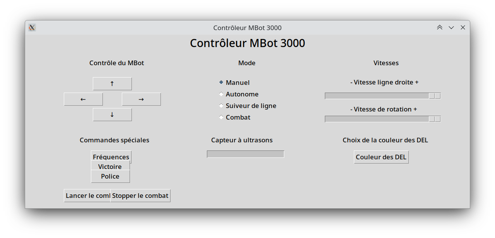

# MBot-sumo-challenge-controleur

Programme de contrôle à distance du MBot avec une interface graphique.

Fonctionne avec le programme Arduino du MBot [suivant](https://github.com/zetiti10/MBot-sumo-challenge).
